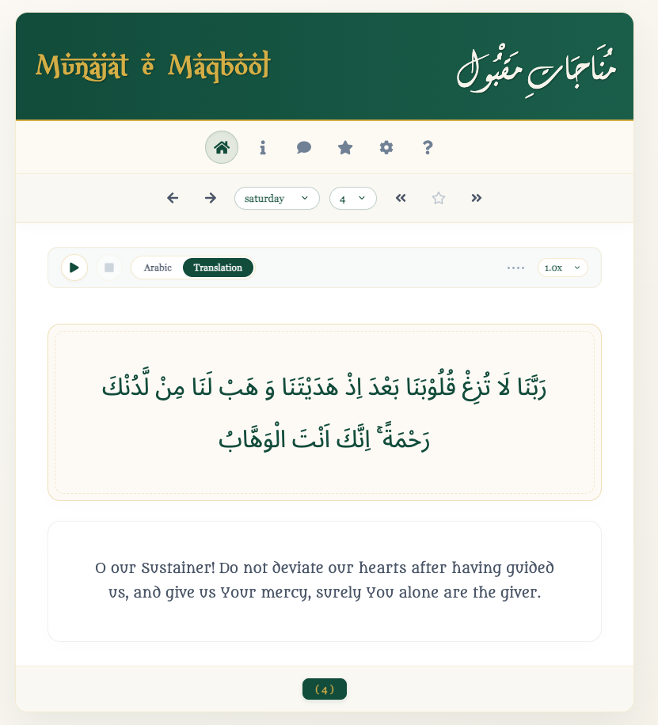

# Munajat-e-Maqbool — Web Client (mm3webclient)

> A digital rendering of the classical Islamic supplication book *Munajat-e-Maqbool* by Hakimul Ummah Maulana Ashraf Ali Thanwi (R), with English and Bengali translations.

---

---

## Overview

**mm3webclient** is the React-based frontend for the Munajat-e-Maqbool web application. It connects to a fully **serverless AWS backend** (`api.munajatemaqbool.com`) to fetch duas (supplications) organized by day of the week and display them in Arabic with an English or Bengali translation.

The application supports:
- 196 duas organized across 7 days of the week
- Trilingual display: Arabic, English, Bengali
- **Dynamic Google Translation**: Add custom languages (e.g., Urdu, Hindi, Spanish, French, Indonesian) dynamically from Settings with automatic client-side translation and caching
- **Modern Premium Design**: Sleek Emerald & Gold spiritual theme with a warm paper/parchment background and smooth transitions
- Bookmarking duas with localStorage persistence
- Keyboard navigation for power users
- Intro (book introduction) and Khutbah sections
- Responsive layout for desktop and mobile

---

## Architecture

### Frontend (this repo)

```
Browser → CloudFront CDN → S3 (static React build)
```

- Built with **React 16** (Create React App)
- Static assets served via **AWS CloudFront + S3**
- No server-side rendering — pure SPA

### Backend (separate serverless project)

```
React App → CloudFront → API Gateway → Lambda → DynamoDB
```

| Service       | Role                                              |
|---------------|---------------------------------------------------|
| API Gateway   | REST API entry point (`api.munajatemaqbool.com`)  |
| CloudFront    | CDN + HTTPS termination for the API               |
| Lambda        | Business logic — fetches dua records              |
| DynamoDB      | Stores all dua content (Arabic, English, Bengali) |
| S3            | Hosts the built React static files                |
| CodeBuild     | CI/CD — builds frontend and syncs to S3           |

---

## API Endpoints

The app talks to `https://api.munajatemaqbool.com`:

| Endpoint        | Description                                            |
|-----------------|--------------------------------------------------------|
| `GET /dua/{id}` | Fetch a single dua by ID (1–196)                       |
| `GET /misc/{id}`| Fetch misc content (intro titles, khutbah, etc.)       |

**Misc ID map:**

| ID | Content                  |
|----|--------------------------|
| 1  | Book title               |
| 2  | Intro start text         |
| 3  | Full intro body          |
| 4  | Khutbah title            |
| 5  | Khutbah start text       |
| 6  | Full khutbah body        |

**Dua response shape:**
```json
{
  "id": 1,
  "number": 1,
  "tags": "saturday",
  "arabic": "...",
  "english": "...",
  "bengali": "..."
}
```

---

## Dua Organization

Duas are indexed 1–196 split across days:

| Day       | Start ID | Count |
|-----------|----------|-------|
| Saturday  | 1        | 48    |
| Sunday    | 49       | 34    |
| Monday    | 83       | 31    |
| Tuesday   | 114      | 33    |
| Wednesday | 147      | 22    |
| Thursday  | 169      | 15    |
| Friday    | 184      | 13    |

---

## Local Development

### Prerequisites

- Node 22.x
- npm >= 10.0.0
- Docker + Docker Compose (optional, for containerized dev)

### Run locally (bare Node)

```bash
cd frontend
npm install
npm start
# App runs at http://localhost:3000
```

### Run locally (Docker)

```bash
# Build image and start container
make rebuild

# App runs at http://localhost:3000
# Source files are volume-mounted for hot reload
```

Makefile targets at project root:

| Command        | Purpose                                          |
|----------------|--------------------------------------------------|
| `make image`   | Build Docker image, clean up dangling images     |
| `make rebuild` | Stop container → rebuild image → start container |
| `make shell`   | Open shell inside running container              |

---

## Build & Deploy (AWS)

AWS CodeBuild uses `buildspec.yml`:

1. Installs Node 22 + npm dependencies
2. Runs `npm run build` → output in `frontend/build/`
3. Artifacts (`frontend/build/**/*`) are uploaded to S3
4. CloudFront serves the static files from S3

To trigger a deployment, push to the connected CodeBuild source repository.

---

## Project Structure

```
mm3webclient/
├── frontend/
│   ├── public/
│   │   ├── index.html          # HTML entry point
│   │   ├── manifest.json       # PWA manifest
│   │   └── favicon.ico
│   ├── src/
│   │   ├── index.js            # Root component (MunjateMaqbool)
│   │   ├── index.css           # Global styles
│   │   ├── title.js / .css     # App header / title bar
│   │   ├── menu.js / .css      # Navigation menu
│   │   ├── content.js / .css   # Main dua viewer
│   │   ├── intro.js / .css     # Book introduction page
│   │   ├── khutbah.js / .css   # Khutbah page
│   │   ├── bookmarks.js / .css # Bookmarks list
│   │   ├── settings.js / .css  # Language settings
│   │   ├── TranslatedText.js   # Dynamic Google Translate wrapper & cache
│   │   ├── help.js / .css      # About & keyboard shortcuts
│   │   ├── fonts.css           # @font-face declarations
│   │   ├── datum/
│   │   │   └── days.js         # Day metadata (begin ID, size, neighbors)
│   │   └── fonts/              # Self-hosted .woff / .woff2 fonts
│   ├── entrypoint.sh           # Docker entrypoint (dev or prod mode)
│   ├── package.json
│   └── package-lock.json
├── Dockerfile                  # Node 22 Alpine image
├── docker-compose.yml          # Local dev compose config
├── buildspec.yml               # AWS CodeBuild spec
├── Makefile                    # Makefile for local development (image, rebuild, shell)
├── .env                        # Local env (CLIENT_APP name)
└── .gitignore
```

---

## Keyboard Shortcuts

When viewing duas (Content view):

| Key           | Action                     |
|---------------|----------------------------|
| `k` / →       | Next dua                   |
| `j` / ←       | Previous dua               |
| `l` / ↑       | Next day                   |
| `h` / ↓       | Previous day               |
| `b`           | Toggle bookmark            |
| `Ctrl + b`    | Go to bookmarks list       |
| `n`           | Next bookmarked dua        |
| `v`           | Previous bookmarked dua    |

---

## State & localStorage

The app persists state to `localStorage`:

| Key             | Value                              |
|-----------------|------------------------------------|
| `prayer`        | Current dua object (JSON)          |
| `prayer.tags`   | Current day string (e.g. saturday) |
| `lang`          | Selected language (english/bengali/custom)|
| `bookmarks`     | Map of bookmarked dua objects      |
| `init`          | Last active view (intro/khutbah/content) |
| `customLanguages`| List of user-added custom languages |
| `customTranslations` | Cached whole-dua custom translations |
| `trans_{lang}_{hash}` | Cached text elements translations mapped by text hash |

---

## Fonts

Self-hosted fonts in `frontend/src/fonts/`:

| Font                         | Script  | Usage              |
|------------------------------|---------|--------------------|
| Georgia                      | Latin   | Body / UI          |
| Metamorphous                 | Latin   | Decorative         |
| XXII Arabian One Night Stand | Latin   | Decorative         |
| Scheherazade                 | Arabic  | Dua Arabic text    |
| Diwani Letter                | Arabic  | Decorative         |
| Noto Sans Arabic UI          | Arabic  | Arabic UI          |
| Li Shadhin Bangla Unicode    | Bangla  | Bengali text       |
| Li-Saboj Charulota Unicode   | Bangla  | Bengali decorative |
| Apona Lohit                  | Bangla  | Bengali alternate  |

---

## Credits

- **Compiled by**: Hakimul Ummah Maulana Ashraf Ali Thanwi (R)
- **Bengali Translation**: Allama Shamsul Haque Faridpuri (R) & Allama Azizul Haque (R)
- **English Translation**: Maulana Muhammed Mahomedy
- **Developer**: [tareqmy.com](https://tareqmy.com) — `tareq.y+mm3@gmail.com`
